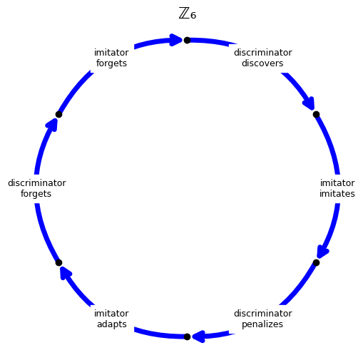
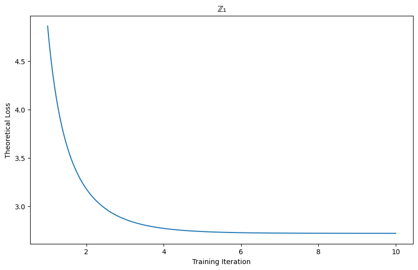
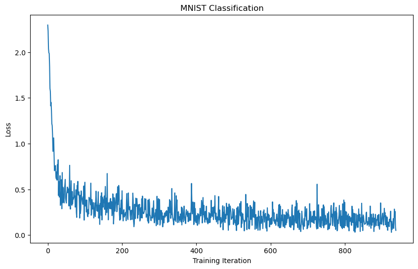
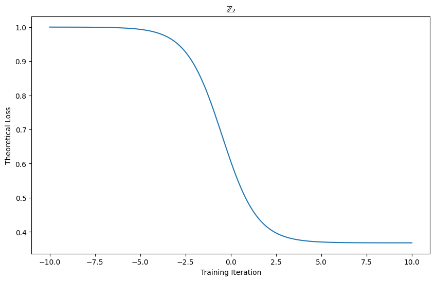
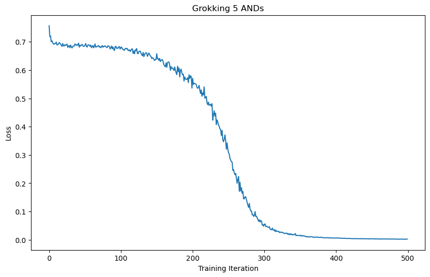
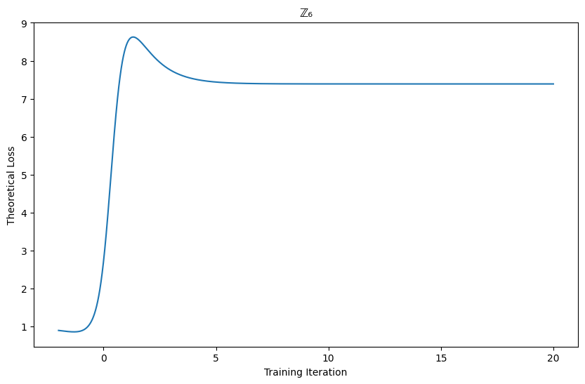
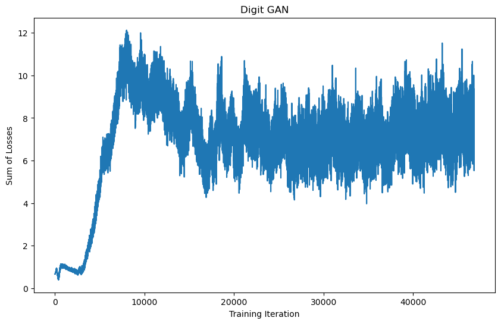

## Solomonoff's Lightsaber

> The simplest explanation is exponentially more important.

Suppose I give you a pattern, and ask you to explain what is going on:

$$1, 2, 4, 8, 16, \dots$$

Several explanations might come to mind:

- "The powers of two,"
- "Moser's circle problem,"
- $\frac{x^4}{24}-\frac{x^3}{12}+\frac{11x^2}{24}+\frac{7x}{12}+1$,
- "The counting numbers in an alien script,"
- "Fine-structure constants."

Some of these explanations are better than others, but they could all be the "correct" one. Rather than taking one underlying truth, we should assign a weight to each explanation, with the ones more likely to produce the pattern we see getting a heavier weight:

$$\text{Grand Unified Explanation} = \sum w_\text{explanation}\cdot\text{explanation}.$$

Now, what exactly is meant by the word "explanation"? Between humans, our explanations are usually verbal signals or written symbols, with a brain to interpret the meaning. If we want more precision, we can program an explanation into a computer, e.g. `fn pattern(n) {2^n}`. If we are training a neural network, an explanation describes what region of weight-space produces the pattern we're looking for, with a few error-correction bits since the neural network is imperfect. See, for example, the paper "[ARC-AGI Without Pretraining](https://iliao2345.github.io/blog_posts/arc_agi_without_pretraining/arc_agi_without_pretraining.html)" (Liao & Gu).

Let's take the view that explanations are simply a string of bits, and our interpreter does the rest of the work to turn it into words, programs, or neural networks. This means there are exactly $2^n$ $n$-bit explanations, and the average weight for each of them is less than $1/2^n$. Now, most explanations—even the short ones—have hardly any weight, but there are still exponentially more longer explanations that are "good"[^1]. This means, if we take the most prominent $n$ explanations, we would expect the remaining explanations to have weight on the order of $\exp(-n)$.

[^1]: As in, need very few error-correcting bits after interpretation. The explanation "fine-structure constants" needs many error-correcting bits such as, "your brain spasmed and misinterpreted the text," while "Moser's circle problem" produces the pattern without any need for error correction.

## Counting Explanations

> What you can count, you can measure.

Suppose we are training a neural network, and we want to count how many explanations it has learned. Empirically, we know the loss comes from all the missing explanations, so

$$\text{Loss}\sim \exp(-\text{explanations})\Longleftrightarrow \text{explanations}\sim -\log(\text{Loss}).$$

However, wouldn't it be more useful to go the other way? To estimate the loss, at the beginning of a training run, by counting how many concepts we expect our neural network to learn? That is our goal for today.

If we assume our optimizers are perfect, we should be able to use every bit of training data, and the proportion of the time a neural net has learned any particular concept will be

$$x = \exp(t - |\text{explanation}|),$$

where $t$ is the training iteration and $|\text{explanation}|$ the bit-length of the concept. The proportion it learns the concept twice is $x^2$, thrice is $x^3$, and so on. We can use the partition function

$$\mathcal{Z}(x) = \sum_{n=0}^\infty x^n =  1 + x + x^2 + x^3 + \cdots = (1-x)^{-1}$$

to keep track of how many times the network has learned a concept. To track multiple concepts, say $x$ and $y$, we would just multiply their partition functions:

$$\mathcal{Z}(x, y) = \mathcal{Z}(x)\mathcal{Z}(y).$$

It's actually more useful to look at the logarithm, that way we can add density functions instead of multiplying partition functions[^2]:

$$\Omega(x) = \ln \mathcal{Z}(x) =-\ln(1-x) = \sum_{n=1}^\infty \frac{x^n}{n}$$

Now, not every model learns by simply memorizing the training distribution. We'll look at three kinds of learning dynamics:

- $\mathbb{Z}_1$—The network memorizes a concept, and continues to overfit on that concept. This is your typical training run, such as with classifying MNIST digits.
- $\mathbb{Z}_2$—The network can only learn a concept once. Equivalently, we can pretend that the network alternates between learning and forgetting a concept. This is for extremely small models, or grokking in larger training runs.
- $\mathbb{Z}_6$—One network is trying to learn and imitate a concept, while another network is trying to discriminate what is real and what is an imitation. Any time you add adversarial loss—such as with GANs or the information bottleneck—you'll get this learning dynamic.

{ width=50% }

In general, a learning dynamic can be described by some group $G$. It's possible to go through several steps at once, so every group element $g\in G$ creates a sub-dynamic. Also, we could begin at any step in the dynamic, at $g$, $g^2$, or so on, up to $g^{|g|}=1$ where $|g|$ is the order of $g$. So, for a particular sub-dynamic $g$, our density function becomes

$$\Omega(g, x) = \sum_{n=1}^\infty \sum_{k=1}^{|g|}\frac{(g^kx)^n}{n} = \sum_{n=1}^\infty\frac{x^{n|g|}}{n} = -\ln\left(1-x^{|g|}\right),$$

since[^3]

$$\sum_{k=1}^{|g|} g^{kn} = \begin{cases}\frac{g^{|g|n+n} - g^n}{g^n-1}=\frac{g^n-g^n}{g^n-1} = 0&n\not\equiv 0\pmod{|g|}\\
1+1+\cdots+1 = |g| &n\equiv 0\pmod{|g|}.\end{cases}$$

To capture the entire group of dynamics, we have to project onto the fundamental representation of our group:

$$\Omega(x) = \sum_{g\in G}\chi(g)\Omega(g, x).$$

Finally, to get back the partition function, we exponentiate:

$$\mathcal{Z}(x)=\exp(\Omega(x)).$$

For the three groups in question, we have

$$\begin{aligned}
&\mathbb{Z}_1: \chi(n) = 1\implies \mathcal{Z}(x) = (1-x)^{-1}\\
&\mathbb{Z}_2: \chi(n) = (-1)^n\implies \mathcal{Z}(x) = 1 + x\\
&\mathbb{Z}_6: \chi(n) = e^{2\pi in/6}\implies \mathcal{Z}(x) = \frac{1+x}{1+x^3}.
\end{aligned}$$

To recover the average number of times a concept has been learned, note that taking a derivative drops out the exponents keeping track of this, e.g.

$$x\cdot \left(x^1 + x^2 + x^3\right)' = x^1 + 2x^2 + 3x^3$$

so the expected number of times a concept has been learned is

$$n(x) = \frac{x\mathcal{Z}'(x)}{\mathcal{Z}(x)}.$$

Putting it altogether, we get

$$\begin{aligned}
&\text{Loss}(\mathbb{Z}_1)\sim \exp\left(\frac{x}{x-1}\right)\\
&\text{Loss}(\mathbb{Z}_2)\sim \exp\left(-\frac{x}{x+1}\right)\\
&\text{Loss}(\mathbb{Z}_6)\sim \exp\left(\frac{x-2x^2}{x^2-x+1}\right)
\end{aligned}$$

for $x \propto \exp(t)$. Here are the plots, with theory on the left and experiment on the right:

|||
| :--------------------------------------: | :----------------------------------------------: |
| { width=45% } | { width=45% } |
| { width=45% } | { width=45% } |
| { width=45% } | { width=45% } |

[^2]: This is known as the [plethystic logarithm](https://en.wikipedia.org/wiki/Plethystic_exponential).
[^3]: This is the same idea as roots of unity filters.